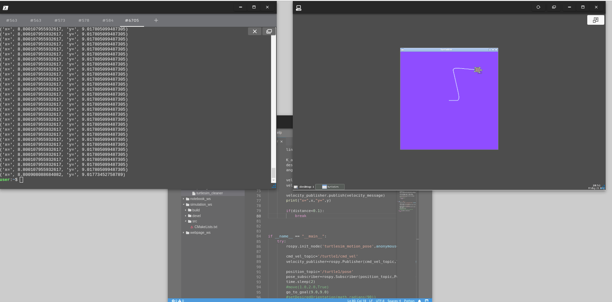
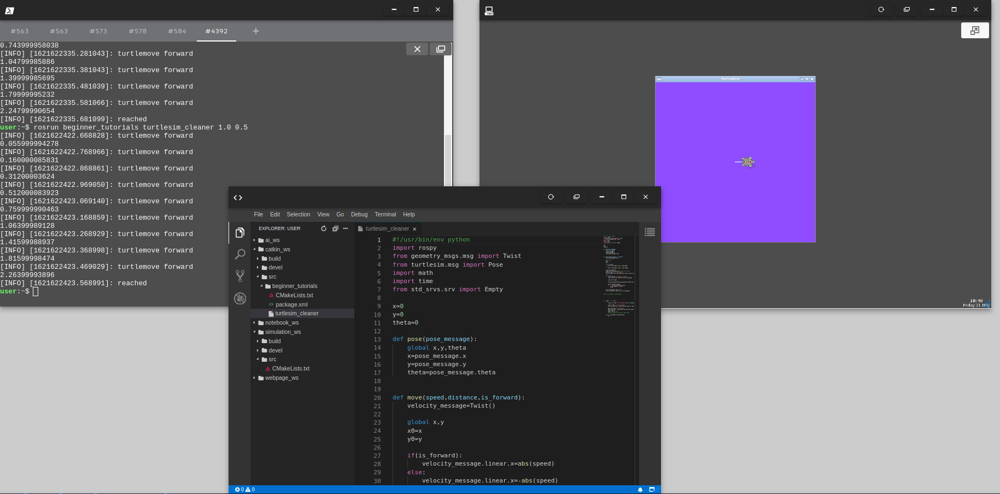
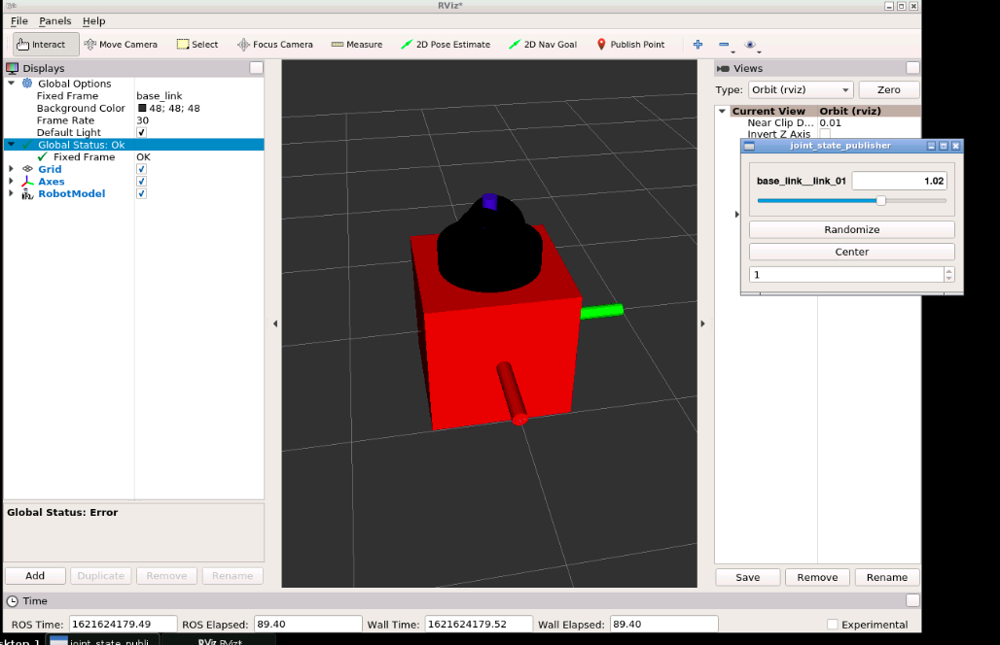

# ITSP-2021

## Tutorials of ROS

the rosworks directory shows the implemenation of package creation and publisher service in ROS

The go_to_goal The python script instructs the turtle to move to a given location with smooth turns instead of the regular rough turns

The move function in the python script instructs the turtle to move a given ditsance and rotate if required

The images attached show the results of the above two functions

## Simulation 

Followed the tutorials of construct https://youtu.be/Ale55LcdZeE 

Created a 4 linked robotic arm for the simulation of our project

Below image shows creation of a mesh file for the simulation 

